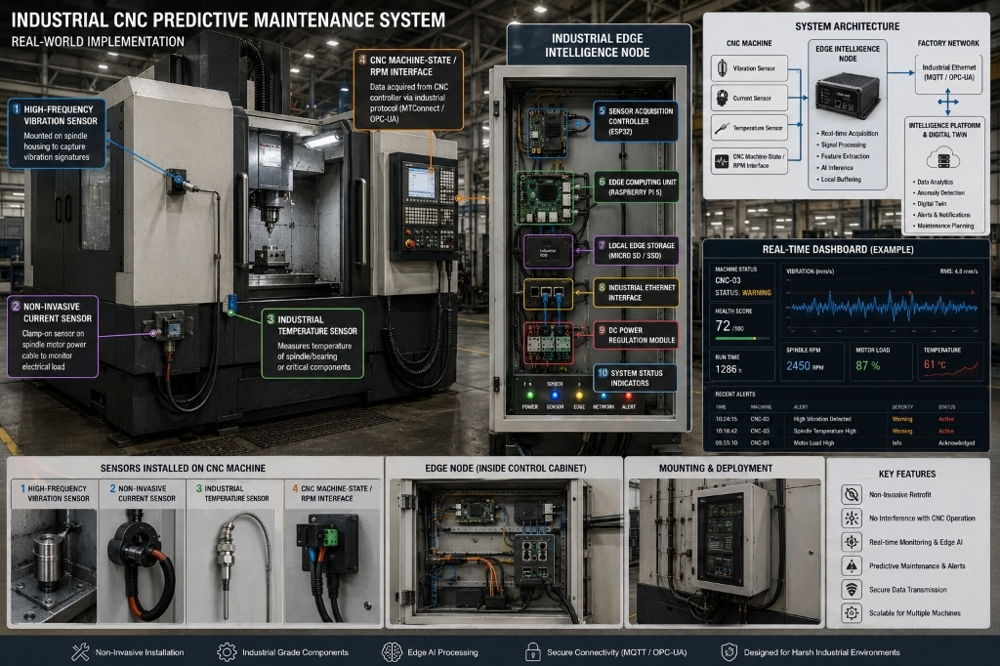

# 🏭 VANTAGE-CNC // Industrial Machine Intelligence & 3D Digital Twin Platform

[](https://www.typescriptlang.org/)
[](https://react.dev/)
[](https://threejs.org/)
[](https://tailwindcss.com/)
[](LICENSE)

An industrial-grade **Machine Intelligence, Predictive Maintenance, & 3D Digital Twin Platform** engineered for high-precision automotive and aerospace machining facilities.

The platform bridges **physical CNC machining centers**, **industrial edge IoT acquisition nodes**, and **cloud/on-premise digital twins** with real-time telemetry correlation, ISO 10816 vibration analytics, explainable health diagnostics, and production OEE intelligence.

---



---

## ⚡ Real-World Implementation Blueprint

The system is designed as a **non-invasive, industrial retrofit** that installs directly onto existing CNC machining centers without interfering with machine tool warranties, CNC motion controllers, or cycle timing.

```
┌─────────────────────────────────────────────────────────────────────────────────────────────────┐
│                                   PHYSICAL-TO-DIGITAL ARCHITECTURE                              │
└─────────────────────────────────────────────────────────────────────────────────────────────────┘

  [ CNC MACHINE SENSORS ]            [ INDUSTRIAL EDGE NODE ]            [ FACTORY NETWORK ]       [ VANTAGE-CNC DIGITAL TWIN ]
  ┌──────────────────────┐           ┌──────────────────────┐            ┌─────────────────┐       ┌───────────────────────────┐
  │ High-Freq Vibration  │ ────────> │ ESP32 Acquisition    │            │                 │       │ 3D Kinematic Model (20 Asm)│
  │ Non-Invasive Current │ ────────> │ Raspberry Pi 5 Edge  │ ─────────> │ MQTT / OPC-UA   │ ────> │ ISO 10816 Vibration Engine│
  │ PT100 Temperature    │ ────────> │ Local NVMe Storage   │ (Ethernet) │ Industrial LAN  │       │ Root-Cause Incident Dossier│
  │ CNC State / RPM (PLC)│ ────────> │ Signal Processing/AI │            │                 │       │ OEE Production Analytics  │
  └──────────────────────┘           └──────────────────────┘            └─────────────────┘       └───────────────────────────┘
```

### 1. Physical Sensor Suite (Machine Mounted)
1. **High-Frequency Vibration Sensor**: Mounted directly to the spindle bearing housing to capture high-frequency acceleration and velocity signatures ($0 \rightarrow 10\text{ kHz}$) for ISO 10816 severity grading.
2. **Non-Invasive CT Current Sensor**: Split-core clamp-on sensor installed over the spindle servo motor power lines to track instantaneous electrical load, torque fluctuations, and peak current draw.
3. **Industrial Temperature Sensor**: Class-A PT100 RTD measuring spindle cartridge, bearing pack, and column temperature gradients to predict thermal elongation and bearing seizure.
4. **CNC Controller Interface**: RS-232 / Ethernet connection extracting native controller feed rates, program numbers, override percentages, and G54 coordinates via **MTConnect / OPC-UA / FOCAS**.

### 2. Industrial Edge Intelligence Node (Control Cabinet)
- **Sensor Acquisition Controller (ESP32)**: High-speed multi-channel ADC sampling with hardware filtering and interrupt-driven timing.
- **Edge Computing Unit (Raspberry Pi 5 / Industrial Linux Gateway)**: Executes edge FFT spectral analysis, RMS vibration calculations, peak-to-peak feature extraction, and anomaly scoring before transmission.
- **Local Edge Buffer Storage (MicroSD / SSD)**: Guarantees zero data loss by buffering telemetry locally during factory network drops or server restarts.
- **Industrial Ethernet Interface**: DIN-rail mounted isolated transceiver streaming deterministic JSON packets over MQTT / OPC-UA at 10 Hz (100 ms interval).
- **DC Power Regulation & Surge Suppression**: 24V industrial supply with over-voltage and reverse-polarity protection.
- **Status LEDs**: Real-time cabinet diagnostic indicators (`POWER`, `SENSOR`, `EDGE`, `NETWORK`, `ALERT`).

---

## 🌟 Software Platform Capabilities

### 🎮 1. Photorealistic 3D CNC Digital Twin Centerpiece
- **20 Discrete Mechanical Assemblies**: Base casting, column, guideways, saddle, worktable, spindle cartridge, BBT40 tool holder, 4-flute TiAlN end mill, 24-pocket ATC carousel, twin-gripper changer arm, chip conveyor, and 19" HMI console.
- **Animated Mechanical Fasteners & Internals**: Socket-head cap screws, leveling bolts, Belleville disc springs, elastomer spider couplings, and helical transmission gears.
- **Interactive Kinematic Controls**:
  - `[ RUN CYCLE ]`: Live spindle rotation ramped up to 10,450 RPM with animated Z-axis helical pocket milling.
  - `[ TOOL CHANGE (ATC) ]`: 11-step twin-gripper mechanical tool swap sequence.
  - `[ ASSEMBLE ] / [ DISASSEMBLE ]`: Synchronized exploded assembly/disassembly animation with unscrewing fasteners.
  - Continuous 0%–100% `EXPLODED` slider.
  - `[ INTERNAL (CUTAWAY) ]`: Physical semi-transparent glass ghosting.
  - `OrbitControls with Damping`: Buttery-smooth $360^\circ$ rotation, panning, zoom, and floor clamping.
  - 9 Camera Presets (`ISO`, `FRONT`, `SIDE`, `TOP`, `CHAMBER`, `SPINDLE`, `INTERNAL`, `ATC`, `EXPLODED`).

### 🔬 2. Explainable Predictive Maintenance & Health Diagnostics
- **Correlated Physics Simulation**:
  - Spindle torque load directly drives headstock thermal climb ($32^\circ\text{C} \rightarrow 64^\circ\text{C}$).
  - Tool flank wear progression accelerates motor torque current and cutting vibration harmonics.
  - ISO 10816 Class II vibration limit trips trigger explainable automated incidents.
- **Multi-Sensor Correlation Matrix**: Correlates load, vibration, and bearing temperature to distinguish between front ceramic bearing race spalling vs. cutting chatter harmonics.
- **4-Step Incident Root-Cause Dossiers**:
  1. *What happened?* (Trigger parameter & threshold comparison)
  2. *What changed in the process?* (Operational delta)
  3. *Possible contributing causes* (Mechanical & electrical hypotheses)
  4. *Recommended corrective actions* (Immediate mitigation procedures)
- **1-Click Work Order Dispatch**: Generate maintenance tickets with assigned teams, technician routing, due schedules, downtime estimates, and required tooling.

### 📊 3. Factory Floor Command Center & OEE Intelligence
- **Interactive Factory Floor Map**: Live node monitoring across **Cell A (Engine Block)**, **Cell B (Transmission)**, and **Cell C (Chassis)**.
- **Machine Fleet Table**: High-density sortable matrix with real-time RPM, load %, temp, vibration, OEE, and health ratings.
- **Production / OEE Loss Analytics**: Availability, Performance, and Quality loss factor breakdown with lost parts calculations and shift capacity analysis.
- **Plant Analytics**: 24H / 7D / 30D / 90D historical trends, specific energy consumption ($\text{kWh/part}$), and downtime Pareto distribution.

### 🎨 4. Aerospace & Automotive Multi-Theme System
Six runtime themes with instant switching, `localStorage` persistence, and 3D WebGL scene lighting synchronization:
1. **OBSIDIAN** *(Default)* — Black Titanium, Graphite, Dark Metal, Champagne Brass (`#C7A86B`)
2. **TITANIUM** — Monochromatic Metal, Precision Engineering (`#AEB7C0`, `#E2E7EB`)
3. **CARBON** — Motorsport Machining, Carbon Fiber Surface, Golden Amber (`#E5A83B`)
4. **MIDNIGHT** — Deep Space AI Diagnostics & Digital Twin Intelligence (`#8C82FF`)
5. **COPPER** — Heavy Mechanical Factory, Forged Bronze (`#B87333`)
6. **ARCTIC** — Precision Cleanroom Light Mode (`#3D556B`, `#FFFFFF`)

---

## 🛠️ Technology Stack

- **Frontend Core**: React 18 + TypeScript
- **Bundler & Dev Server**: Vite 5
- **3D Graphics & WebGL**: Three.js (PBR MeshStandard / MeshPhysical materials, OrbitControls, dynamic shadow maps)
- **Animation Engine**: Anime.js
- **Design System & Styling**: Tailwind CSS with CSS Custom Properties & Semantic Design Tokens
- **Icons & Visuals**: Lucide React

---

## 🚀 Getting Started

### 1. Clone the repository
```bash
git clone https://github.com/srinath200888-create/VANTAGE-CNC-.git
cd VANTAGE-CNC-
```

### 2. Install dependencies
```bash
npm install
```

### 3. Start development server
```bash
npm run dev
```

Open **[http://localhost:3000](http://localhost:3000)** in your browser.

### 4. Build for production
```bash
npm run build
```

---

## 📂 Project Structure

```
industrial-cnc-platform/
├── docs/
│   └── images/                # Real-world implementation diagrams & architecture visuals
├── public/                    # Static assets
├── src/
│   ├── components/            # UI components (MetricCard, StatusBadge, TopBar, AppShell, Modal...)
│   ├── domain/                # 20 mechanical assemblies, machine registry, health engine
│   ├── simulation/            # Correlated physics telemetry simulator & 8 demo scenarios
│   ├── state/                 # Single source of truth store, EventBus, useMachineStore
│   ├── theme/                 # 6-theme definition dictionary, CSS variable manager, context
│   ├── twin3d/                # Three.js scene, materials, 20-assembly model builder, kinematics
│   ├── types/                 # Domain interfaces, telemetry packets, alerts, work orders
│   ├── views/                 # Platform views (Overview, Factory, Workspace, Spindle, Alerts...)
│   ├── App.tsx                # Top-level view router & theme wrapper
│   ├── index.css              # Design tokens, micro-grid texture, custom scrollbars
│   └── main.tsx               # Entrypoint & Runtime Error Boundary
├── index.html                 # HTML shell
├── package.json
├── tailwind.config.js         # Semantic design token mappings
├── tsconfig.json
└── vite.config.ts             # Dev server host & port configuration
```

---

## 📄 License

MIT License © 2026 Srinath Ramesh.
